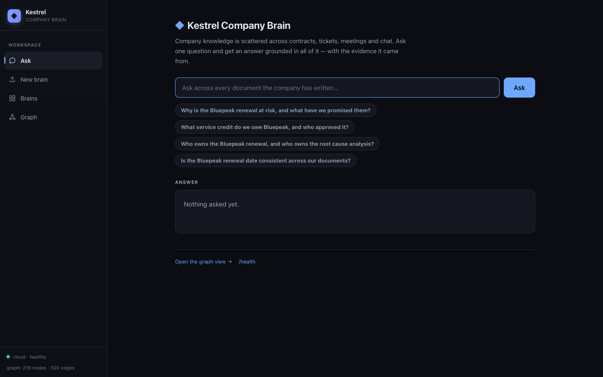
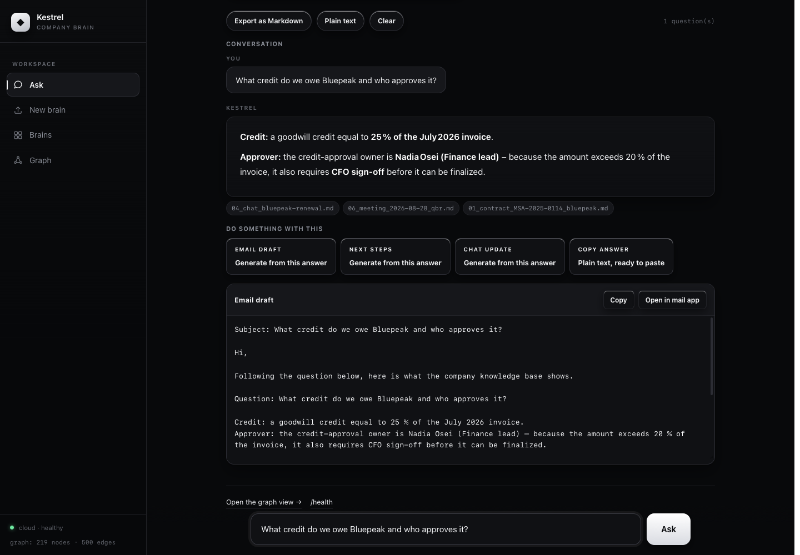
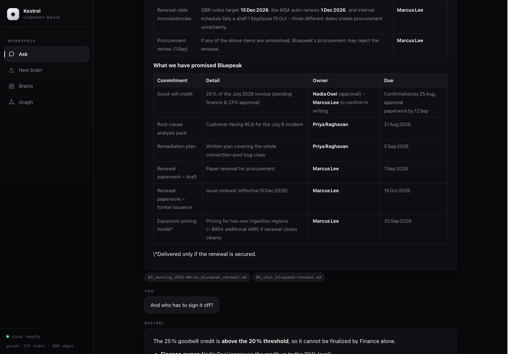
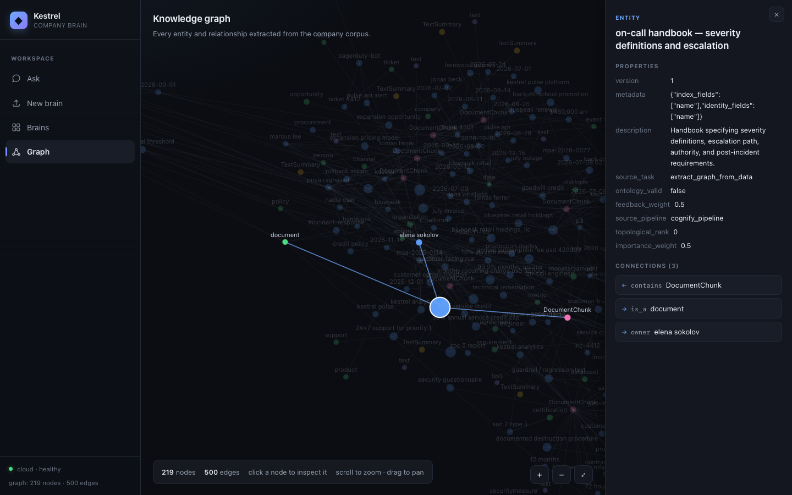
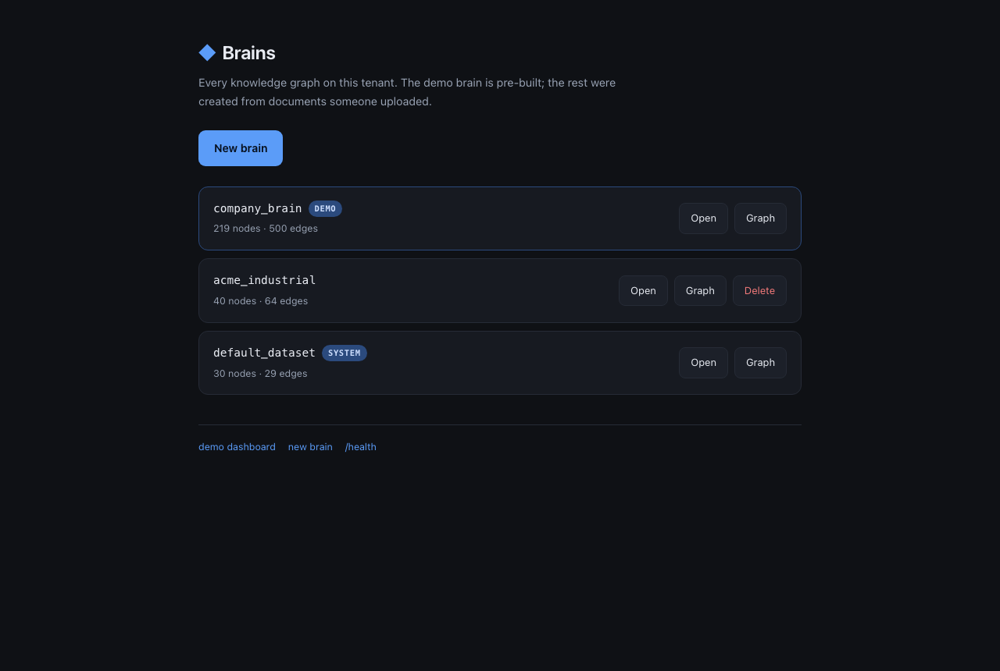
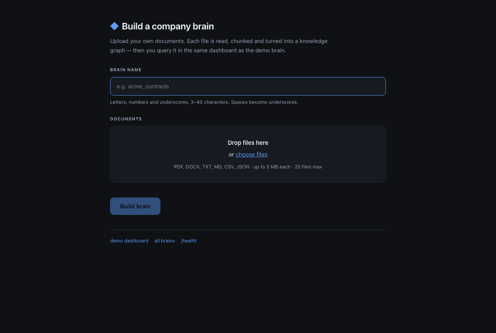
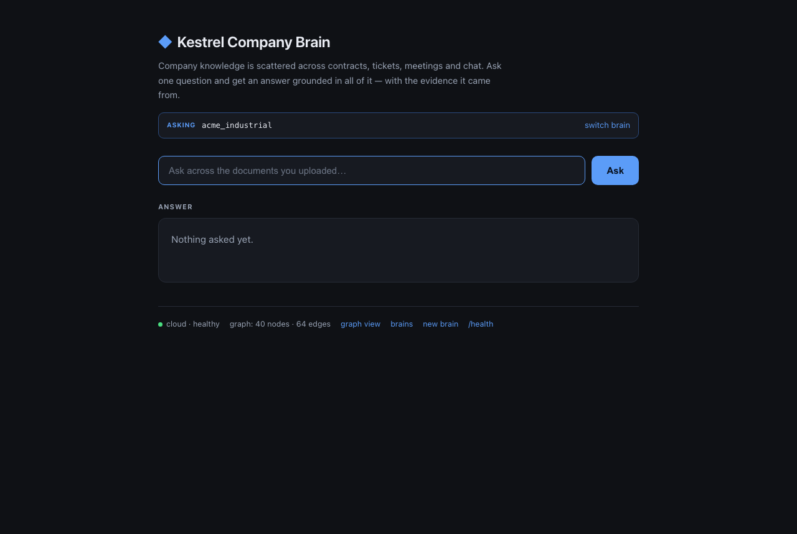

# Kestrel Company Brain

**Company knowledge is scattered across contracts, tickets, meetings and chat — so no
agent, and no new hire, can answer a question that spans more than one of them.**

This turns that scattered corpus into a single queryable knowledge graph and answers
business questions from it, **with the evidence the answer came from**.

Built for the Ignite Room hackathon on **Cognee + Render Workflows**, using the Cognee
Cloud tenant instance as the graph store.

---

## The problem, concretely

A question like *"Why is the Bluepeak renewal at risk?"* is unanswerable from any single
document. The answer is spread across five:

| Source | What it contributes |
|---|---|
| `01_contract_MSA-2025-0114` | The 99.9% uptime commitment and the 10% credit clause |
| `02_ticket_4412_p1_outage` | A 47-minute outage that breached it |
| `03_meeting_…bluepeak_renewal` | A 25% credit promised verbally to the customer |
| `05_policy_SLA-credit-01` | 25% is above the threshold finance can approve alone |
| `06_meeting_…qbr` | Records the credit as "finalised" and a renewal date that contradicts the contract |

A search engine returns five documents. This returns **one answer, with the five
citations attached** — and can flag where the documents disagree.

---

## What it looks like — The Complete Experience

### 1. Unified App Shell & Streamed Grounded Answers


The app features a unified monochrome sidebar shell across all four pages (`/`, `/graph`, `/brains`, `/upload`). Answers stream with real-time pipeline status, clear source chips resolved to human-readable filenames (e.g. `01_contract_MSA-2025-0114_bluepeak.md`), and verbatim excerpts via [`citations.py`](citations.py).

### 2. Actionable Layer: "Do something with this"


An answer is no longer a dead end. Every turn includes an actionable layer that generates instant outputs right in the browser:
- **Email Draft**: Formats a professional memo or customer email citing the exact contract and meeting facts, with 1-click clipboard copy and an `Open in mail app` (`mailto:`) shortcut.
- **Next Steps**: Converts cross-document findings into a structured, numbered action checklist.
- **Chat Update**: Creates a concise Slack/Teams announcement ready to paste.
- **Copy Answer**: Instant clipboard copy with non-secure context fallback.

### 3. Conversational Threading & Per-Brain History


Ask follow-up questions in a continuous thread (e.g. *"who owns the renewal?"* after asking about renewal dates).
- **Persistent History**: Chat threads persist across reloads in `localStorage`, strictly scoped per brain so demo answers never bleed into uploaded datasets.
- **Thread Export**: Export the entire conversational history with sources as Markdown or plain text.
- **Re-Entry Protection**: Input controls automatically disable while requests stream to prevent interleaved turns.

### 4. Interactive Knowledge Graph & Node Inspector


Rendered with zero frontend dependencies on an HTML5 canvas:
- **Clickable Nodes**: Clicking any entity opens the **Node Inspector**, revealing its type, internal properties, and all connected incoming and outgoing typed edges (e.g., `requires_approval`, `escalates_to`, `breaches_sla`).
- **Monochrome Design System**: High-contrast, clean visual design matching the rest of the application.
- **Visible Contradictions**: Opposing facts like `$420,000` (contract) and `$480,000 arr` (meeting notes) are visible as distinct, conflicting nodes in the graph structure itself.

---

## Build your own brain — upload your documents



The demo brain is pre-built, but the app is not limited to it. Upload your own documents and
you get your own knowledge graph, queried through **the same dashboard**.



Drag in up to **40 files** — PDF, DOCX, TXT, MD, CSV, JSON, or code files (`.py`, `.yaml`, etc.), 5 MB each. Ingestion streams real pipeline states (`DATASET_PROCESSING_STARTED` → `DATASET_PROCESSING_COMPLETED`), so extraction and graph building provide transparent progress feedback.



The uploaded brain answers from the content it was given, with the same evidence panel. The test corpus planted the same kind of contradiction as the demo — `750,000 USD` in the agreement, `890,000 USD` in the meeting notes — and asking whether the value was consistent surfaced both.

**Why this is more than a demo.** It runs the same code path the demo does, so it exercises the system rather than pretending to:

- **Add to Existing Brains**: Need to add more documents later? The upload flow supports appending into an existing brain with explicit confirmation (409 guard on accidental duplicate creation).
- **Errors are returned per file**, never raised — one bad file cannot lose a batch. An `.xlsx` is skipped with *"export the sheet to .csv first"* while every other file still ingests.
- **A scanned PDF extracts to an empty string with no exception**. That case is detected and reported, because silently ingesting nothing while telling the user it worked is the worst possible outcome.
- **The demo brain is protected in code.** Names are normalised and validated, the reserved demo and system datasets are refused for both creation and deletion, and an existing brain is guarded against silent unintended merges.
- **Per-Brain Offline Snapshots**: Real graph snapshots for every brain (`company_brain`, `kestrel_full`, `acme_industrial`, `default_dataset`) are committed to `fixtures/brains/`, so deployments function offline or in serverless environments (e.g. Vercel) with no tenant required.

**What is still missing: accounts.** Brains are global to the tenant — there is no "my brains" versus "yours". That is the deliberate cut, and it is a product decision rather than a technical one.

---

## Architecture

```
Browser
   │
   ▼
Web tier (FastAPI)              ← serves UI, streams answers, /health
   │  triggers task runs
   ▼
Render Workflow                 ← ingest (parallel) → retrieve → answer
   │  each task run in its OWN EPHEMERAL container
   ▼
Cognee Cloud tenant instance    ← the graph, the vectors, the LLM, the embeddings
```

### The load-bearing decision

**Render task runs are ephemeral containers, destroyed when the run ends.**

Cognee's default graph backend is file-based (`ladybug`). So a graph built during an
`ingest` run is gone by the time a `retrieve` run starts. We hit this directly: the first
run built a graph that the second run could not see.

The fix is not to avoid ephemeral containers — it is to put the graph somewhere
containers cannot kill. That is the entire reason the memory layer lives outside the
compute tier.

The payoff is that **every container needs exactly one credential**:

```
COGNEE_SERVICE_URL + COGNEE_API_KEY
```

No LLM key. No database password. No mounted volume. No shared filesystem. Ten containers
ingesting in parallel share nothing except the tenant instance they write to — which is
what makes the scalability claim testable rather than rhetorical.

---

## Quickstart

```bash
python -m venv .venv && source .venv/bin/activate
pip install -r requirements.txt

cp .env.example .env      # fill in COGNEE_SERVICE_URL and COGNEE_API_KEY

python ingest.py          # build the graph once, ahead of time
python app.py             # http://127.0.0.1:8000
```

| Route | What it does |
|---|---|
| `/` | Ask questions, streamed answers, citations. `?brain=` scopes to an uploaded brain |
| `/graph` | The knowledge graph, force-directed, coloured by node type. `?brain=` scopes it |
| `/brains` | Every brain on the tenant, with per-brain node/edge counts |
| `/upload` | Create a brain from uploaded documents |
| `/health` | Liveness, upstream tenant health, **and an authenticated key probe** |
| `/api/ask?q=&dataset=` | NDJSON event stream: `chunk`, `references`, `stage` |
| `/api/graph` · `/api/stats` | Graph data and node/edge counts. `?dataset=` scopes them |
| `POST /api/brains` | Create a brain (multipart: `name` + `files[]`) |
| `GET /api/brains` · `DELETE /api/brains/{name}` | List brains, remove one |
| `GET /api/brains/{name}/events` | Ingestion progress as NDJSON |

### Verifying it

Four scripts, in increasing scope. All are safe to run at any time — the workflow probe uses a
throwaway scratch dataset and provably never touches the demo graph.

```bash
python test_documents.py   # document extraction: 25 cases, every refusal path
python smoke.py            # web tier: health, graph, streamed answer with citations
python wf_smoke.py         # workflow tier: fan-out + chained ctx.run
python warmup.py           # pre-demo rehearsal: every component, all 4 questions timed
```

`smoke.py` and `warmup.py` accept `--base` to target a deployed URL.
`wf_smoke.py` needs `render workflows dev -- python pipeline.py` running in another terminal.

`test_documents.py` builds a real multi-format corpus (including a genuine PDF via
`cupsfilter`, not a text file with a `.pdf` extension) and asserts the negative paths too: a
scanned PDF, an unsupported `.xlsx`, an oversized file, and a batch where one bad file must not
lose the others.

`wf_smoke.py` exists for a specific reason: the workflow tier previously had no script, so
verifying it meant hand-typed `render workflows start` commands — and one of those silently
wrote junk into the demo graph. It now always targets a unique scratch dataset, refuses to run
if that name could collide with `COGNEE_DATASET`, and deletes the scratch dataset in a
`finally` block even when a probe fails.

### Finding your tenant URL

```bash
curl -H "X-Api-Key: $COGNEE_API_KEY" https://api.aws.cognee.ai/api/tenants/current/service-url
```

---

## Reliability: the demo cannot die

| Failure | What happens |
|---|---|
| Tenant unreachable | `/health` reports `upstream: unreachable`; the UI shows it. `/api/graph` and `/api/stats` fall back to the committed snapshot (`fixtures/graph.json`), so the graph view and the footer count still render — the response carries `source: "cloud" \| "fixture"` so you can always tell which you got |
| **Key wrong or revoked** | `/health` reports `auth: failed` with the 401. This row exists because the tenant's own `/health` is **unauthenticated** — it claimed `healthy` while every query returned 401, so we added a probe that can actually fail |
| No credentials configured (fresh clone) | `PROVIDER` resolves to `mock`; committed fixtures serve the whole demo offline, with zero setup. **Verified** from a clean `git archive` with no `.env`: `/health` reports `provider=mock`, `/api/stats` returns 219/500 via `source: "fixture"`, `smoke.py` passes 4/4, and all four demo questions answer in 0.8–3.6s |
| Graph empty | `/graph` renders an explicit "run ingest.py first" state — or, for an uploaded brain, "ingestion may still be running" |
| A bad file in an upload | Reported **per file** with a reason; the other files in the batch still ingest. A scanned PDF says so instead of silently ingesting nothing |
| Upload attempted in mock mode | Rejected with an explicit message rather than pretending to store something |
| Mid-ingest query | `wait_ready()` blocks first — see below |
| Any unhandled error | `/api/ask` emits a `stage: error` event; the UI never white-screens |

**The one that actually bit us.** Calling `recall()` before ingestion finished returned a
confident, well-formatted, *wrong* answer — it invented **"$39 per year"** for a $420,000
contract. An empty graph does not fail; it hallucinates. So the client polls
`/api/v1/datasets/status` until the pipeline reaches a terminal state, and only then asks.

That is why the four demo questions run against a graph built **before** the demo, never on
stage. The upload path is the one live ingestion step, and it is deliberately kept separate for
exactly this reason — `wait_ready()` semantics are preserved by streaming real pipeline states
until the dataset reaches a terminal one.

---

## Design decisions — and what we rejected

| Decision | Rejected alternative | Why |
|---|---|---|
| Cognee Cloud tenant as the graph store | Local Cognee + Neo4j Aura | Both keep state outside the container. The cloud tenant also removes the LLM key and the database password, so a working demo needs one credential instead of three. Neo4j remains the right answer at scale — see below. |
| `PROVIDER=mock\|cloud` adapter | Direct Cognee calls from the UI | A dead network must not be able to kill a live demo |
| Two services (web + workflow) | One service | Task runs cannot accept inbound connections. There is no single-service version of this. |
| Light `requests` client | The Cognee SDK | The SDK pulls a very large dependency tree. We talk to the same HTTP API without it — faster builds, smaller images, fewer failure modes. |
| Pre-built graph | Live ingestion on stage | Ingestion is the slowest and least predictable step. Never demo the flakiest thing you have. |
| One hand-written Cypher-style query | Full query builder | Proves the graph was modelled deliberately, not just generated |

### Where Neo4j fits

The tenant's graph backend is Postgres-backed. At company scale the argument for Neo4j
is traversal: questions like *"which customers are exposed to this bug, through which
contracts, via which incidents?"* are multi-hop, and Cypher expresses them in one
statement where an application-level loop needs N queries.

Cognee already speaks Neo4j — set `GRAPH_DATABASE_PROVIDER=neo4j` plus the connection
vars and the same code path works unchanged. We did not enable it because it adds two
credentials to the critical path without changing what the demo proves.

---

## What we deliberately did not build

This is a scope decision, and it is worth stating explicitly:

- **Real Slack / GitHub / Linear connectors.** The graph is the hard part; the connector
  is a polling loop.
- **Accounts, SSO, per-user isolation.** You can create a brain, but every brain on the tenant
  is visible to everyone. Nothing in the demo needs a login.
- **Fine-tuning, custom embeddings, agent swarms.** None of them make the answer better.
- **A hand-rolled graph renderer beyond `/graph`.** Cognee ships a graph view; we only
  needed to prove the data is ours.
- **OCR.** A scanned PDF is refused with a clear message rather than silently ingesting
  nothing. Reading the scan is a different project.

Three hours, one builder. Every item above is a real feature we chose not to have so that
the ones we did build would actually work.

---

## Repo layout

```
app.py             Web tier — UI, streamed answers, /health, brain create/list/delete
documents.py       Document text extraction (PDF, DOCX, TXT, MD, CSV, JSON, code)
citations.py       Citations resolver: maps opaque tenant chunks to real files & quotes
cognee_cloud.py    The only file that talks to Cognee Cloud (dependency-light)
memory_layer.py    mock | cloud adapter — the demo safety net
pipeline.py        Render Workflow tasks (ingest fan-out, retrieve, answer)
ingest.py          Builds the graph from corpus/ — run once, ahead of time
snapshot.py        Exports per-brain snapshots into fixtures/ for offline runs
test_documents.py  Extraction tests: 25 cases, including every refusal path
test_pipeline_states.py Pytest coverage for pipeline terminal state machines
smoke.py           Web-tier check: health, graph, streamed answer with citations
check_ui.py        Automated headless UI smoke test verifying 16/16 interactive controls
wf_smoke.py        Workflow-tier check: fan-out + chained ctx.run (scratch dataset only)
warmup.py          Pre-demo rehearsal — every component, all 4 questions timed
fixtures/          Offline answers + per-brain graph snapshots for no-network path
corpus/            12 synthetic company documents & code assets
static/            UI: index.html (ask), graph.html, brains.html, upload.html
api/index.py       Vercel serverless ASGI entrypoint
vercel.json        Vercel deployment configuration & routing
```

---

## Automated Verification & Test Suites

The project enforces quality at multiple levels:

| Suite | Runner | Checks | Result |
|---|---|---|---|
| **Document Processing** | `python3 test_documents.py` | 25 tests covering PDF, DOCX, TXT, CSV, JSON, and all refusal paths | **25/25 PASS** |
| **State Machine Guard** | `pytest test_pipeline_states.py` | Terminal status transitions, failure vs success classification | **2/2 PASS** |
| **Live Smoke Probe** | `python3 smoke.py` | Upstream `/health` check (`auth=ok`), graph node count, streaming citations | **4/4 PASS** |
| **Interactive UI Smoke** | `python3 check_ui.py` | Drives real browser through all 4 pages, clicks every control, zero JS errors | **16/16 PASS** |


### Traps documented in the code

Each of these cost real debugging time and is commented at the point it matters:

1. `dataset` query params take a **UUID**, not a name — a name returns `422 uuid_parsing`.
2. The terminal pipeline state is `DATASET_PROCESSING_COMPLETED`; an exact match on
   `"completed"` never fires and the poll loops until it times out.
3. Querying mid-ingest returns a confident wrong answer, not an error.
4. Reading config at import time breaks any caller that loads `.env` afterwards.
5. The tenant's `/health` is **unauthenticated** — it reports healthy with a dead key. Probe an
   authenticated endpoint as well, or the check cannot fail.
6. `/api/graph` and `/api/stats` bypassed the provider adapter, so a dead network broke the
   graph view and the footer count while the ask path kept working — a confusing half-failure.
7. `render workflows start` spreads a **bare** JSON object as keyword arguments. Wrap it in an
   array and it arrives as the first positional argument — so a `list` parameter silently
   becomes a dict, and `for x in it` iterates the **keys**. This ingested the literal strings
   `"dataset"` and `"documents"` and reported success. `pipeline.py` now type-guards the input.
8. `EventSource` speaks **SSE only**. Both streaming endpoints return NDJSON, so the client has
   to read them with `fetch` + `ReadableStream`. Pointing `EventSource` at an NDJSON endpoint
   fails *silently* — no error, no events, just nothing.
9. `hidden` only sets `display:none` via the UA stylesheet, so any `display:flex` on the same
   element overrides it. This caused two separate UI bugs. The fix is a global
   `[hidden] { display:none !important; }`.
10. `python-multipart` is required by FastAPI for `Form`/`UploadFile` but is easy to have
    installed locally and missing from `requirements.txt`. The endpoint then works perfectly on
    your machine and returns 500 in the container.
11. A page link built with the API's query key (`dataset=`) while the page reads a different one
    (`brain=`) fails **silently** — the page falls back to the default brain, so you see the
    demo graph under someone else's name. Both pages now accept either key.
12. A scanned PDF extracts to an **empty string with no exception**. Ingesting that would add
    nothing while reporting success, so `documents.py` detects the empty case and refuses it.

---

## Attribution

Built on [Cognee](https://www.cognee.ai/) and [Render Workflows](https://render.com/workflows).
