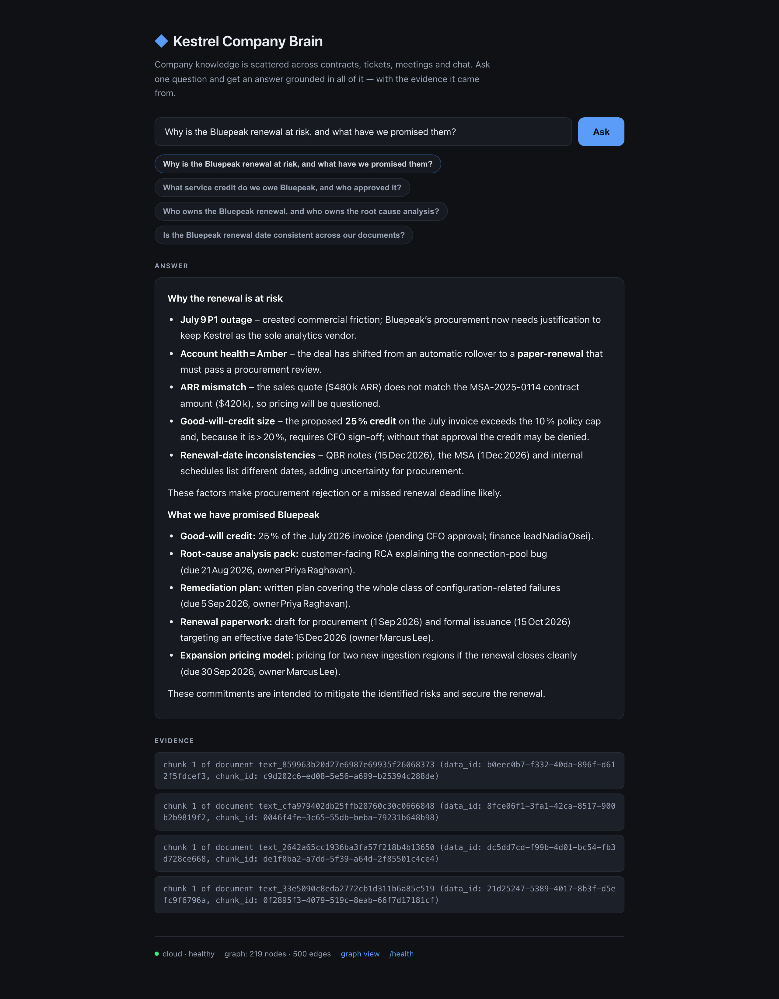
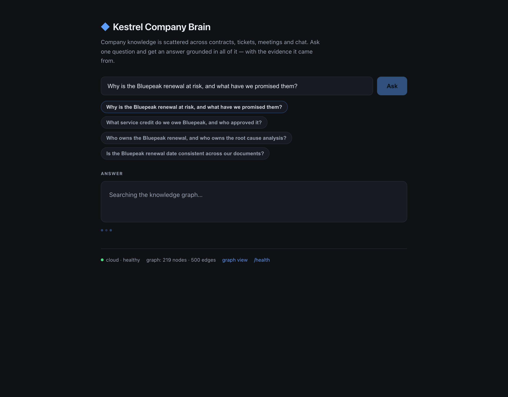
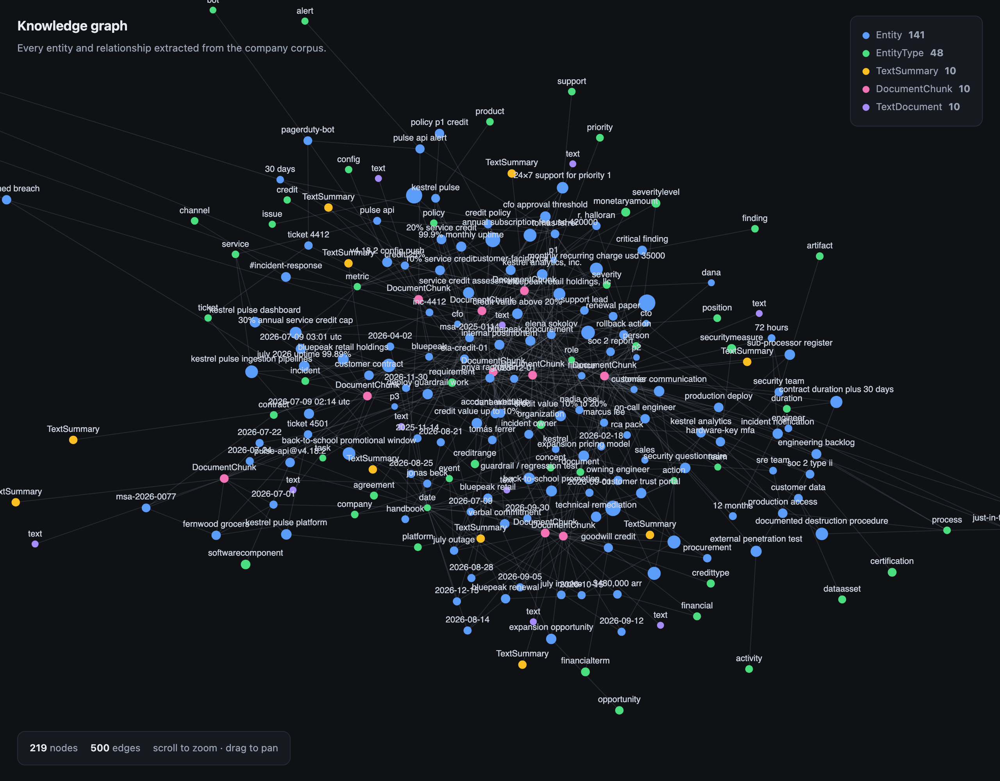
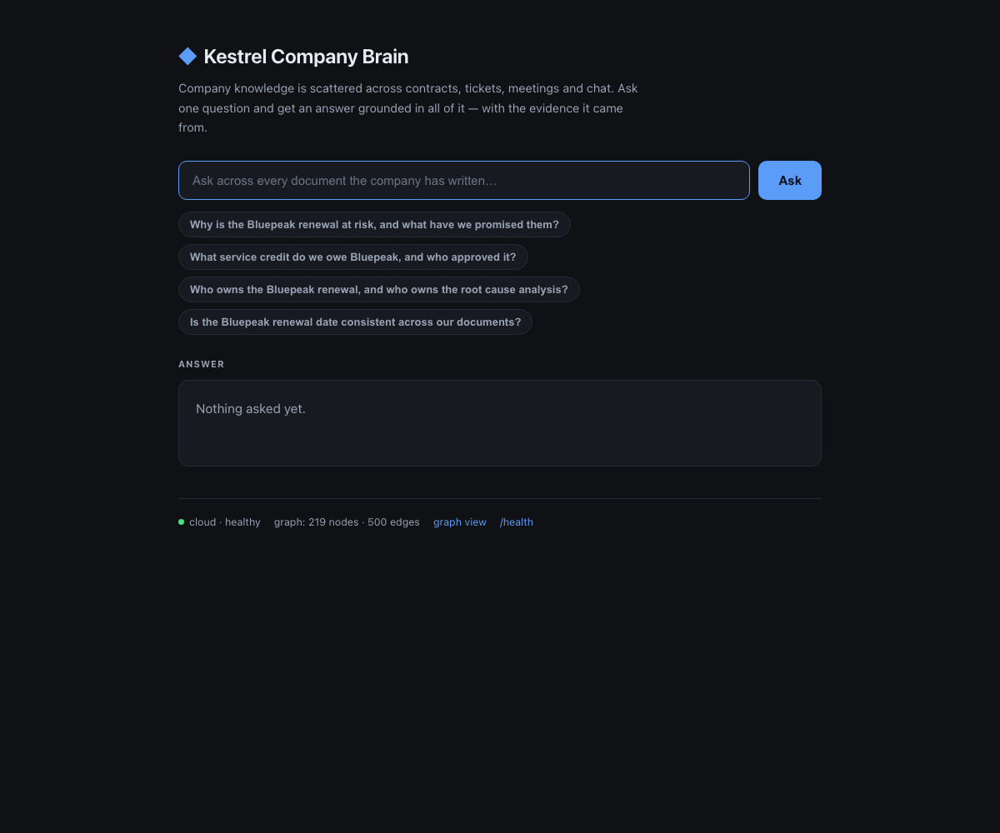

# Kestrel Company Brain

**Company knowledge is scattered across contracts, tickets, meetings and chat — so no
agent, and no new hire, can answer a question that spans more than one of them.**

This turns that scattered corpus into a single queryable knowledge graph and answers
business questions from it, **with the evidence the answer came from**.

Built for the Ignite Room hackathon on **Cognee + Render Workflows**, using the Cognee
Cloud tenant instance as the graph store.

---

## The problem, concretely

A question like *"Why is the Bluepeak renewal at risk?"* is unanswerable from any single
document. The answer is spread across five:

| Source | What it contributes |
|---|---|
| `01_contract_MSA-2025-0114` | The 99.9% uptime commitment and the 10% credit clause |
| `02_ticket_4412_p1_outage` | A 47-minute outage that breached it |
| `03_meeting_…bluepeak_renewal` | A 25% credit promised verbally to the customer |
| `05_policy_SLA-credit-01` | 25% is above the threshold finance can approve alone |
| `06_meeting_…qbr` | Records the credit as "finalised" and a renewal date that contradicts the contract |

A search engine returns five documents. This returns **one answer, with the five
citations attached** — and can flag where the documents disagree.

---

## What it looks like



The answer arrives formatted — headings, bold, bullet lists, and often a table, because the
underlying facts are tabular. The exact shape varies between runs; the renderer handles
tables, lists and headings either way, so the UI never shows raw `**markdown**` or `|---|`.
Note the **ARR mismatch** entry: the system found the contract says `$420k` while the sales
quote said `$480k` — nobody asked it to compare those two numbers. It also caught that a
promised 25% credit exceeds the 10% policy baseline and needs CFO sign-off.



Recall runs server-side before the first token is emitted, so there is a **~18 second gap**
before the answer starts streaming. Rather than leave a blank box and a spinner — which
reads as broken — the UI says what it is doing. This was measured, not assumed: first chunk
at 17.8s, then 226 chunks over 3s.



219 nodes and 500 edges extracted from ten documents, rendered from our own `/api/graph`.
Both `$420,000` and `$480,000 arr` appear as separate nodes — the contradiction is visible
in the graph itself.



Every suggested question is one the pre-built graph is known to answer well. They double as
a demo safety net: the presenter never has to improvise a query on stage.

---

## Architecture

```
Browser
   │
   ▼
Web tier (FastAPI)              ← serves UI, streams answers, /health
   │  triggers task runs
   ▼
Render Workflow                 ← ingest (parallel) → retrieve → answer
   │  each task run in its OWN EPHEMERAL container
   ▼
Cognee Cloud tenant instance    ← the graph, the vectors, the LLM, the embeddings
```

### The load-bearing decision

**Render task runs are ephemeral containers, destroyed when the run ends.**

Cognee's default graph backend is file-based (`ladybug`). So a graph built during an
`ingest` run is gone by the time a `retrieve` run starts. We hit this directly: the first
run built a graph that the second run could not see.

The fix is not to avoid ephemeral containers — it is to put the graph somewhere
containers cannot kill. That is the entire reason the memory layer lives outside the
compute tier.

The payoff is that **every container needs exactly one credential**:

```
COGNEE_SERVICE_URL + COGNEE_API_KEY
```

No LLM key. No database password. No mounted volume. No shared filesystem. Ten containers
ingesting in parallel share nothing except the tenant instance they write to — which is
what makes the scalability claim testable rather than rhetorical.

---

## Quickstart

```bash
python -m venv .venv && source .venv/bin/activate
pip install -r requirements.txt

cp .env.example .env      # fill in COGNEE_SERVICE_URL and COGNEE_API_KEY

python ingest.py          # build the graph once, ahead of time
python app.py             # http://127.0.0.1:8000
```

| Route | What it does |
|---|---|
| `/` | Ask questions, streamed answers, citations |
| `/graph` | The knowledge graph, force-directed, coloured by node type |
| `/health` | Liveness, upstream tenant health, **and an authenticated key probe** |
| `/api/ask?q=` | NDJSON event stream: `chunk`, `references`, `stage` |
| `/api/graph` · `/api/stats` | Graph data and node/edge counts |

### Finding your tenant URL

```bash
curl -H "X-Api-Key: $COGNEE_API_KEY" https://api.aws.cognee.ai/api/tenants/current/service-url
```

---

## Reliability: the demo cannot die

| Failure | What happens |
|---|---|
| Tenant unreachable | `/health` reports `upstream: unreachable`; the UI shows it |
| **Key wrong or revoked** | `/health` reports `auth: failed` with the 401. This row exists because the tenant's own `/health` is **unauthenticated** — it claimed `healthy` while every query returned 401, so we added a probe that can actually fail |
| No credentials configured (fresh clone) | `PROVIDER` resolves to `mock`; committed fixtures serve the whole demo offline, with zero setup |
| Graph empty | `/graph` renders an explicit "run ingest.py first" state |
| Mid-ingest query | `wait_ready()` blocks first — see below |
| Any unhandled error | `/api/ask` emits a `stage: error` event; the UI never white-screens |

**The one that actually bit us.** Calling `recall()` before ingestion finished returned a
confident, well-formatted, *wrong* answer — it invented **"$39 per year"** for a $420,000
contract. An empty graph does not fail; it hallucinates. So the client polls
`/api/v1/datasets/status` until the pipeline reaches a terminal state, and only then asks.

That is why the graph is built **before** the demo, never on stage.

---

## Design decisions — and what we rejected

| Decision | Rejected alternative | Why |
|---|---|---|
| Cognee Cloud tenant as the graph store | Local Cognee + Neo4j Aura | Both keep state outside the container. The cloud tenant also removes the LLM key and the database password, so a working demo needs one credential instead of three. Neo4j remains the right answer at scale — see below. |
| `PROVIDER=mock\|cloud` adapter | Direct Cognee calls from the UI | A dead network must not be able to kill a live demo |
| Two services (web + workflow) | One service | Task runs cannot accept inbound connections. There is no single-service version of this. |
| Light `requests` client | The Cognee SDK | The SDK pulls a very large dependency tree. We talk to the same HTTP API without it — faster builds, smaller images, fewer failure modes. |
| Pre-built graph | Live ingestion on stage | Ingestion is the slowest and least predictable step. Never demo the flakiest thing you have. |
| One hand-written Cypher-style query | Full query builder | Proves the graph was modelled deliberately, not just generated |

### Where Neo4j fits

The tenant's graph backend is Postgres-backed. At company scale the argument for Neo4j
is traversal: questions like *"which customers are exposed to this bug, through which
contracts, via which incidents?"* are multi-hop, and Cypher expresses them in one
statement where an application-level loop needs N queries.

Cognee already speaks Neo4j — set `GRAPH_DATABASE_PROVIDER=neo4j` plus the connection
vars and the same code path works unchanged. We did not enable it because it adds two
credentials to the critical path without changing what the demo proves.

---

## What we deliberately did not build

This is a scope decision, and it is worth stating explicitly:

- **Real Slack / GitHub / Linear connectors.** The graph is the hard part; the connector
  is a polling loop.
- **Auth, multi-tenancy, admin panel.** Nothing in the demo needs a login.
- **Live ingestion on stage.** See above.
- **Fine-tuning, custom embeddings, agent swarms.** None of them make the answer better.
- **A hand-rolled graph renderer beyond `/graph`.** Cognee ships a graph view; we only
  needed to prove the data is ours.

Three hours, one builder. Every item above is a real feature we chose not to have so that
the ones we did build would actually work.

---

## Repo layout

```
app.py             Web tier — serves UI, streams answers, /health
cognee_cloud.py    The only file that talks to Cognee Cloud (dependency-light)
memory_layer.py    mock | cloud adapter — the demo safety net
pipeline.py        Render Workflow tasks (ingest fan-out, retrieve, answer)
ingest.py          Builds the graph from corpus/ — run once, ahead of time
corpus/            10 synthetic company documents
static/            UI (index.html) and graph view (graph.html)
```

### Traps documented in the code

Each of these cost real debugging time and is commented at the point it matters:

1. `dataset` query params take a **UUID**, not a name — a name returns `422 uuid_parsing`.
2. The terminal pipeline state is `DATASET_PROCESSING_COMPLETED`; an exact match on
   `"completed"` never fires and the poll loops until it times out.
3. Querying mid-ingest returns a confident wrong answer, not an error.
4. Reading config at import time breaks any caller that loads `.env` afterwards.

---

## Attribution

Built on [Cognee](https://www.cognee.ai/) and [Render Workflows](https://render.com/workflows).
